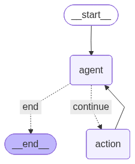

# Financial Analyst AI Agent 📈

An intelligent conversational AI assistant for equity research and stock analysis, built with LangGraph, LangChain, and Streamlit. The agent provides real-time stock prices, comprehensive technical analysis, and side-by-side stock comparisons with human-in-the-loop clarification for ambiguous queries.

## Features

- **Real-Time Stock Prices**: Fetch current market prices for any publicly traded stock
- **Comprehensive Analysis**: Get detailed reports including:
  - Historical performance (YTD, 1-year returns, 52-week high/low)
  - Technical indicators (RSI, MACD)
  - Financial metrics (P/E ratio, debt-to-equity, profit margins, market cap)
- **Stock Comparison**: Compare multiple stocks side-by-side across key metrics
- **Ambiguity Handling**: Interactive clarification system prevents ticker confusion (e.g., F vs FORD)
- **Dark Mode UI**: Modern, user-friendly Streamlit interface with chat history

## Tech Stack

- **LangGraph**: Agent orchestration and state management
- **LangChain**: LLM integration with tool-calling capabilities
- **OpenAI GPT**: Language model for natural language understanding
- **Streamlit**: Interactive web interface
- **yfinance**: Real-time financial data
- **pandas & pandas-ta**: Data processing and technical analysis

## Project Structure

```
Mini_Project_1_Ajitesh_ReddyT/
├── agent.py                 # LangGraph agent logic and workflow
├── app.py                   # Streamlit UI and chat interface
├── tools.py                 # Custom tools for stock data retrieval
├── visualize_graph.py       # Graph visualization utility
├── .env                     # Environment variables (API keys)
├── requirements.txt         # Python dependencies
└── README.md               # Project documentation
```

## Installation

### Prerequisites
- Python 3.9 or higher
- OpenAI API key
- Internet connection for real-time data

### Setup

1. **Clone the repository**
   ```bash
   git clone https://github.com/Ajiteshreddy7/Projects.git
   cd Mini_Project_1_Ajitesh_ReddyT
   ```

2. **Create a virtual environment**
   ```bash
   python -m venv .venv
   .\.venv\Scripts\Activate.ps1  # Windows PowerShell
   # OR
   source .venv/bin/activate  # Linux/Mac
   ```

3. **Install dependencies**
   ```bash
   pip install -r requirements.txt
   ```

4. **Set up environment variables**
   
   Create a `.env` file in the project root:
   ```env
   OPENAI_API_KEY=your_openai_api_key_here
   ```

## Usage

### Run the Application

```bash
python -m streamlit run app.py
```

The app will open in your browser at `http://localhost:8501`

### Example Queries

- "What is the current price of MSFT?"
- "Analyze AAPL stock"
- "Compare GOOGL and META"
- "Give me a full analysis of TSLA"

### Visualize Agent Graph

To generate a visualization of the agent workflow:

```bash
python visualize_graph.py
```

This creates `graph_visualization.png` showing the agent's decision flow.

## How It Works

1. **User Input**: User asks a question via the Streamlit chat interface
2. **Agent Processing**: LangGraph agent analyzes the query and determines appropriate action
3. **Ambiguity Check**: If ticker is ambiguous, agent requests clarification with options
4. **Tool Execution**: Once clear, agent calls relevant tools (price, analysis, comparison)
5. **Response Generation**: Agent synthesizes data into natural language response
6. **Display**: Results shown in chat with proper formatting

## Tools Available

| Tool | Description |
|------|-------------|
| `get_current_stock_price` | Fetches real-time stock price |
| `get_full_stock_analysis` | Comprehensive analysis with historical, technical, and financial data |
| `compare_stocks` | Side-by-side comparison of multiple stocks |
| `request_user_clarification` | Interactive clarification for ambiguous queries |

## Architecture

The project uses a **LangGraph** state machine with the following nodes:

- **Agent Node**: Calls LLM to decide next action
- **Action Node**: Executes selected tools
- **Conditional Edge**: Determines whether to continue or end conversation

### Agent Workflow Diagram



The visual above shows the agent's decision flow:
- **Start** → **Agent** node evaluates the query
- **Conditional edge** checks if tools are needed
- If "continue" → **Action** node executes tools → loops back to **Agent**
- If "end" → conversation terminates

## Configuration

Key settings in `agent.py`:
- **Model**: `ChatOpenAI(temperature=0, streaming=True)`
- **Tools**: Bound to LLM via `.bind_tools(tools)`
- **State**: Tracked via `AgentState` TypedDict


## Troubleshooting

### Common Issues

1. **"streamlit not found"**
   - Ensure virtual environment is activated
   - Run: `python -m streamlit run app.py`

2. **"Could not fetch price" error**
   - Check ticker symbol is valid
   - Verify internet connection
   - Some delisted stocks won't have data

3. **API rate limits**
   - yfinance has rate limits; wait and retry
   - Consider caching for repeated queries

4. **Import errors**
   - Reinstall dependencies: `pip install -r requirements.txt`
   - Check Python version: `python --version` (must be 3.9+)

## Future Enhancements

- [ ] Add news sentiment analysis
- [ ] Implement portfolio tracking
- [ ] Add more technical indicators (Bollinger Bands, Fibonacci)
- [ ] Support for cryptocurrency analysis
- [ ] Export reports to PDF
- [ ] Historical backtesting capabilities

## Contributing

Contributions are welcome! Please feel free to submit a Pull Request.

## License

This project is licensed under the MIT License - see the LICENSE file for details.

## Author

**Ajitesh Reddy T**
- GitHub: [@Ajiteshreddy7](https://github.com/Ajiteshreddy7)

## Acknowledgments

- LangChain & LangGraph for agent framework
- OpenAI for GPT models
- yfinance for financial data
- Streamlit for rapid prototyping
